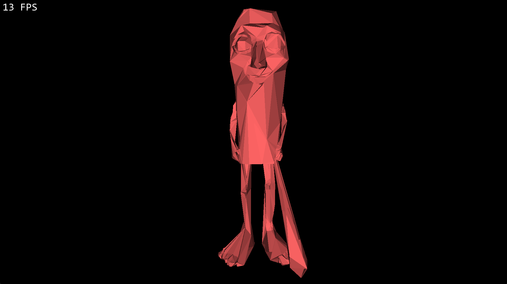
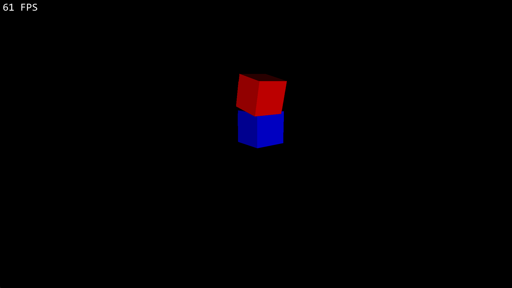

# Python-3D-engine
A python simple 3D object rendering made "from stratch"

## Utilisation
### 3D engine
the program can be controled using the mouse and ZQSD SPACE and SHIFT.
A console is aviable in the terminal. for now the only supported command is:
```
tp x y z
```
where x y and z are ints.


The simulation class takes multiple arguments, which are:
Dimensions: A tuple of int
meshs: The meshs to load (See below for more)
Launcher (Optionnal): A Class. Use it if you need to add the launcher in another pygame project. The Simulation will call the following attributs:
```
Launcher.screen
Launcher.dimensions
Launcher.font
Launcher.font_color
```
Meaning that the pygame project need to have a self.r.screen refering to the pygame surface, a self.dimensions refering to the dimentions (tubple of two int), a self.font refering to the font (pygame.font. ...) and a self.font_color (tuple of 3 int).

### Aditionnal classes
Inclued Mesh class:
  take points (see below in examples) and a color
included Rotating_Mesh:
  take points (see below in examples), a color and 3 rotation (x,y,z) 

Stl loader classes:
  a Mesh_from_stl class, taking a file path and a color

###Examples of utilisation:
Load a stl file
```
meshs = [stl_loader.Mesh_from_stl("name.stl",(255,255,255))
		 ]
Simulation((1920,1080),meshs)

```



Use simples shapes:
```
  meshs = [
  Rotating_Mesh([[[-1, -1, -1],[1, -1, -1],[1, 1, -1], [-1, 1, -1],[-1, -1, 1],[1, -1, 1], [1, 1, 1], [-1, 1, 1] ],
  [    [0, 1, 2, 3],  [4, 5, 6, 7],[0, 1, 5, 4],[3, 2, 6, 7],[0, 3, 7, 4],[1, 2, 6, 5]]],(255,0,0),0,0,0.02),

  Mesh([[[1, -1, -1],[3, -1, -1],[3, 1, -1], [1, 1, -1],[1, -1, 1],[3, -1, 1], [3, 1, 1], [1, 1, 1] ],
  [    [0, 1, 2, 3],  [4, 5, 6, 7],[0, 1, 5, 4],[3, 2, 6, 7],[0, 3, 7, 4],[1, 2, 6, 5]]],(0,0,255))
  ]
  	Simulation((1920,1080),meshs)

```

